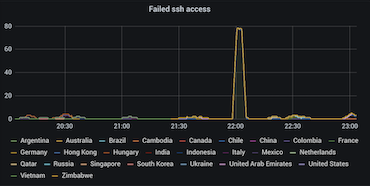
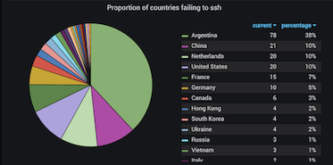

# ssh-to-prom

Track failed ssh connection attempts on your host and expose them as enriched prometheus metrics.

 

## Installation

`go get -u github.com/prccaraujo/ssh-to-prom`

## Usage

`ssh-to-prom -f <ssh_log_file> -m <prometheus port> -g <geolocation_active>`

The tool can be somewhat configured by passing some command-line flags when using it.

| Flag | Description  |
|---|---|
| `-f` | Location of the failed authentication log files, typically located at `/var/log/auth.log` or `/var/log/secure` in unix based systems. Default: `/var/log/auth.log`. |
| `-m` | The prometheus port to be exposed. Default: `:2112` |
| `-g` | Enable geolocation services, which allows the tracked IP's to be mapped to their geolocation. Failed connections will be reported as coming from "unknown". Default: `true` |
| `-d` | Enable debug logs. Default: `false` |

## Dependencies

- 2 (optional) geolocation services. It performs an http call to one (or both) of them for each ssh attempt detected in order to geolocate the incoming IP address. If you want to disable this, check the `-g` flag
- `papertrail/go-tail` (and `fsnotify/fsnotify` as it's dependency) in order to track and read ssh log file changes
- `prometheus/client_golang` for the prometheus exporter client
- `sirupsen/logrus` for some readable logs
- `stretchr/testify` for some readable tests

## Geolocation

The tool uses two different geolocation providers, in case the main one reaches the rate limit:

- Main: `ip-api.com`
- Backup: `api.ipstack.com`

The backup geolocator requires an access key in order to work, so if you want to use it as well, you'll have to provide an access key (which you can get at the website for free) by setting the environment variable `SSH2PROM_IPSTACK_ACCESSKEY`.

## Contributing

If you want to contribute, just open an issue or pull request and we can work it out together.
